# LotsofPresents  
This project involves the development of an e-commerce web application for LotsofPresents, a company specializing in a diverse range of products including beds, technology, and more. The platform is designed to offer a seamless online shopping experience, showcasing a wide variety of items and enabling users to make purchases directly through the site.

This is Milestone Project 4 for a Level 5 Diploma in Web Application Development.   

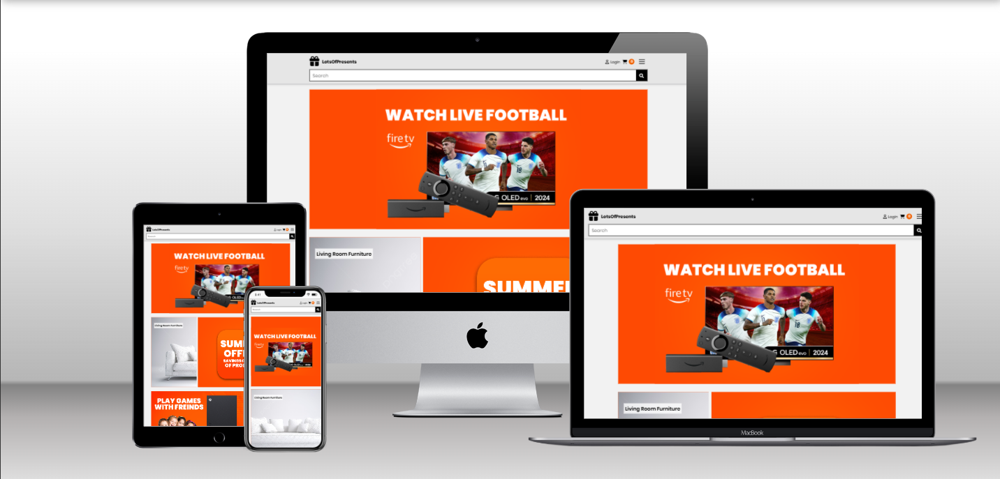

Link to live site: [LotsofPresents](https://lotsofpresents-a08e5dcfe2dd.herokuapp.com/)

## CONTENTS

* [User Experience](#user-experience-ux)
  * [User Stories](#user-stories)

* [Design](#design)
  * [Colour Scheme](#colour-scheme)
  * [Typography](#typography)
  * [Layout](#layout)
  * [Imagery](#imagery)
  * [Wireframes](#wireframes)
  * [Data Model](#data-model)
  * [Security](#security)
  * [Future Updates](#future-updates)

* [Features](#features)
  * [Future Implementations](#future-implementations)
  * [Accessibility](#accessibility)

* [Technologies Used](#technologies-used)
  * [Languages Used](#languages-used)
  * [Frameworks, Libraries & Programs Used](#frameworks-libraries--programs-used)

* [Testing](#testing)

* [Deployment](#deployment)

* [Credits](#credits)
  * [Code Used](#code-used)
  * [Content](#content)
  * [Media](#media)
  * [Acknowledgments](#acknowledgments)
  
  ---

## User Experience (UX)  

## User Stories

### Navigation
| As a/an        | I want my customers to be able to...            | So that they can...                                   |
| -------------- | ----------------------------------------------- | -----------------------------------------------------|
| Business owner | Easily navigate the site using a navbar         | Move between different pages with ease               |
| Business owner | View available products                         | Find detailed information and see additional images of the listings |
| Business owner | View their order history                        | Plan their journey to the site from their location    |

### Registration and User Accounts
| As a/an        | I want my customers to be able to...            | So that they can...                                   |
| -------------- | ----------------------------------------------- | -----------------------------------------------------|
| Business owner | Easily register for an account                  | Have a personal account and view their profile       |
| Business owner | Easily log in or log out                        | Access their personal information                    |
| Business owner | Quickly access their user profile               | Access their account efficiently                     |
| Business owner | Have a personalized user profile                | View their order history and update their default delivery address |

### Purchasing and Checkout
| As a/an        | I want my customers to be able to...            | So that they can...                                   |
| -------------- | ----------------------------------------------- | -----------------------------------------------------|
| Business owner | Add items to the basket and checkout without registering | Use the site with less commitment if they choose to |
| Business owner | See that their basket has items from any page   | Keep track of their basket contents                  |
| Business owner | Receive messages when items are added to their basket | Immediately know if the products they selected are in the basket |
| Business owner | Easily enter their payment information          | Check out quickly and without hassle                 |
| Business owner | Receive an email confirmation after checkout    | Keep the information for their records               |

### Products Page
| As a/an        | I want my customers to be able to...            | So that they can...                                   |
| -------------- | ----------------------------------------------- | -----------------------------------------------------|
| Business owner | View detailed product information               | Make informed purchasing decisions                   |
| Business owner | Filter products by category (e.g., beds, garden, technology, kitchen, pet supplies) | Easily find the specific type of product they are looking for |
| Business owner | Select different sizes and variations of products (e.g., bed sizes, colors) | Purchase items that best suit their needs            |
| Business owner | View multiple images of products                | Get a clear idea of the product’s appearance and features |

### Ratings & Reviews
| As a/an        | I want my customers to be able to...            | So that they can...                                   |
| -------------- | ----------------------------------------------- | -----------------------------------------------------|
| Business owner | Add a review                                    | Promote the site in a positive light                 |
| Business owner | Edit a review                                   | Make changes to their review if needed               |
| Business owner | Delete a review                                 | Remove their review if necessary                     |

## Design  

### Colour Scheme

Initial colour scheme is general light theme for a contemporary look, I have included platinum/grey & orange as accent colours which will also provide good accessibility scores.  

### Typography

The font used throughout the site is 'Poppins', I have chosen this font because I consider it to be clean and easy to read.  

### Layout

The layout of the LotsofPresents website is built using custom css and js, which provides full customabilty that allows the website to look unique and different to the same old style, i also used media quries to allow it to adapt to different screen sizes and devices.   

### Accessibility  

I ran the site through a wave validator to ensure there were no accessibility errors. There is one contrast error but i find this to minor as its the color of my theme, all forms have labels or aria labels and images have alts.
 

### Imagery  
Used a combination of imagery from different websites as i found it hard to find good free images. Images are all of a similar size and quality for consistency throughout the site.

### Wireframes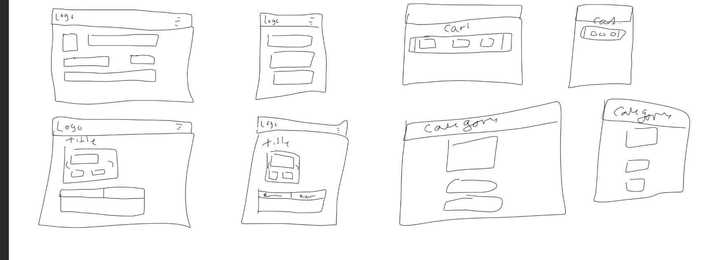
There have been some changes since the wireframe was created. 

### Data Model  
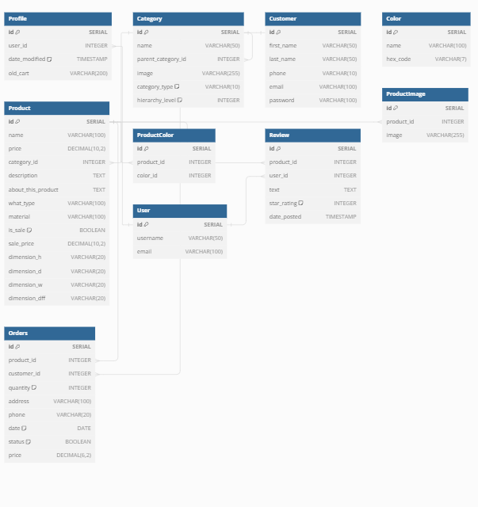
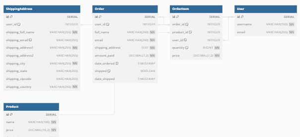 

The following datbase models were used;  
Orders -  used to store users oreder information.  
Order line items -  used to handle order infromation in basket.  
Products -  Used to add information about products on site.  
Users -  Used in user registration.  
Contacts -  Used for customer contact form.  
Profiles -  Used to enable users to access order history and update default deilvery information.  
Reviews -  Used for users to add reviews on the site.  

### Security    

A number of different security considerations were taken into account when putting together this project.    

**Use of .env file**  
Important credentials including DATABASE_URL, SECRET_KEY, STRIPE keys, AWS ACCESS KEYS and GMAIL passwords are located within .env file which is subsequently in a .gitignore file to ensure it remains secure. SECRET_KEY was initially located in settings.py file, it has since been changed and moved to a more secure location in .env file, the database was also subsequently destroyed and rebuilt to produce a different DATABASE_URL.  

**Defensive Programming**  
Measures have been put in place throughout the site to prevent users from doing things they are not authorised to do. For example, Users can only access the product admin panel if they are superusers. Users can not access the profile page unless they are authenticated and can also not add reviews.  

**Feedback to Users**  
Toast messages provide feedback to users about the status of their actions. For example, 'successful login or reasons for authentication failure'.  

## Features

### General features  

**Sign up/login**  
Users have the ability to sign up, using Djangos built in authenticaton process.  
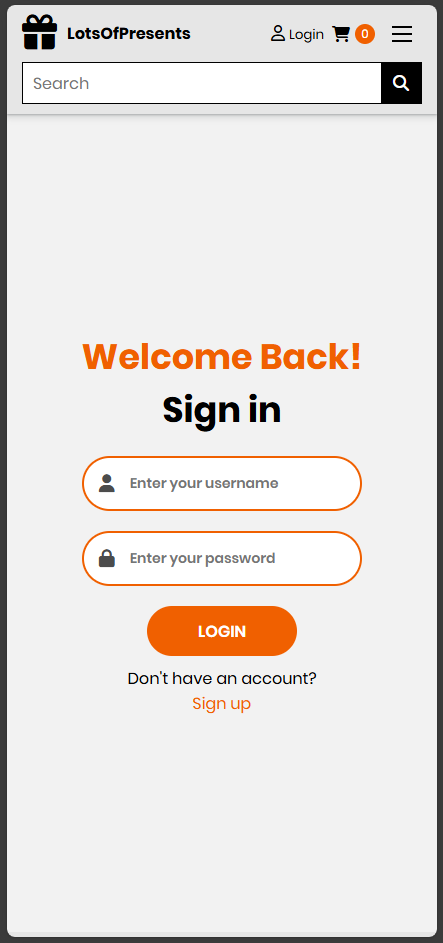
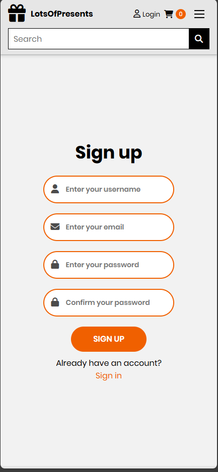

**Navbar**  

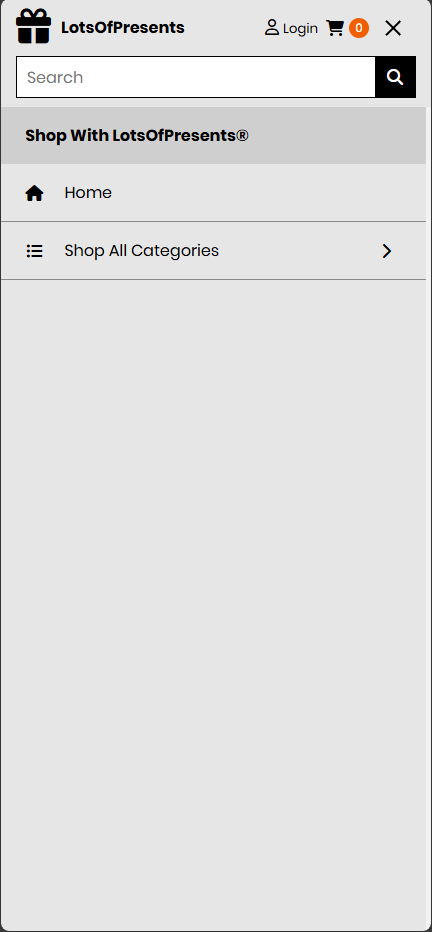
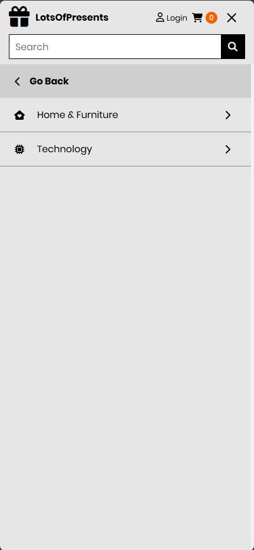
**Home page**   
 
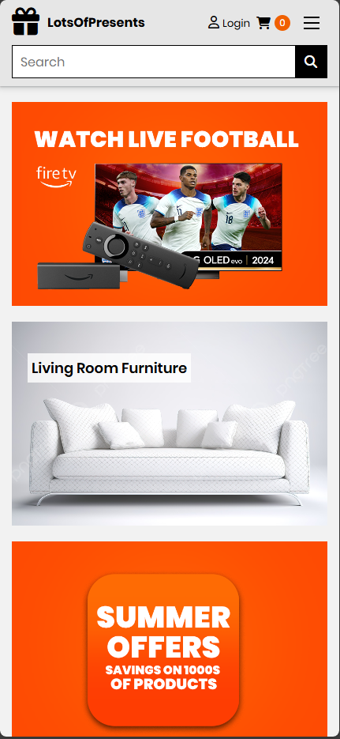

**Image Carousel**  
Product Image Carouse
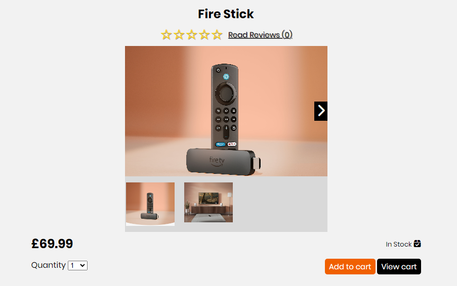

**Products page**  
Products landing page that includes all products. 
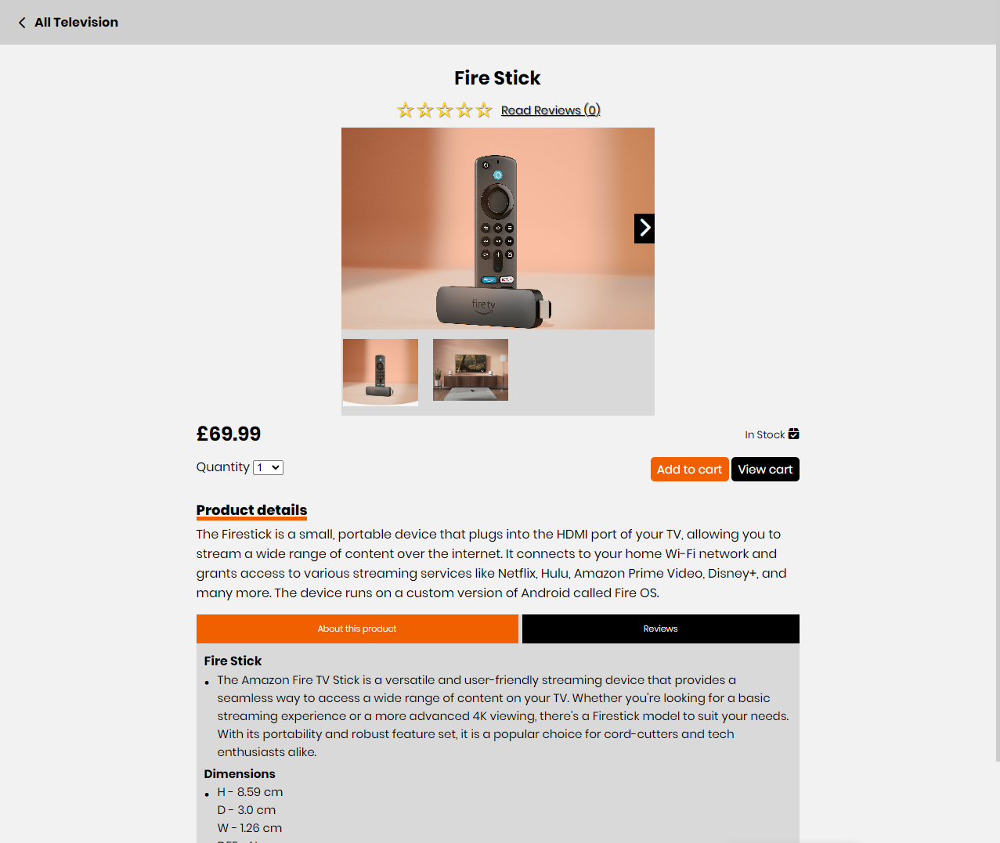

**Product details page**  
Page for each indivdual product, users have the option to customise the product they are purchasing. They can change the size, colour, embroidery location, embroidery text and quantity. Users have the option to 'add to basket' or 'keep shopping'.  
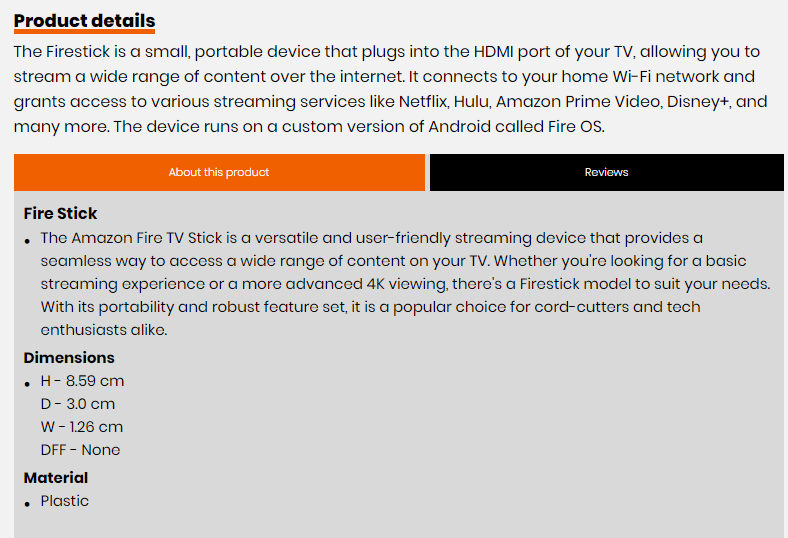

**Profile pages for account and shipping**  
Users are presnted with an option to update default delivery information and view their order history. Page is styled using bootstrap to handle responsiveness.  
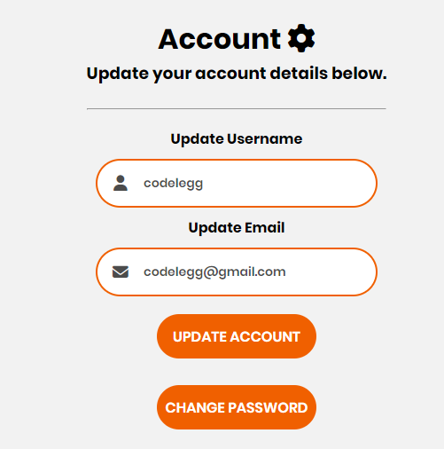
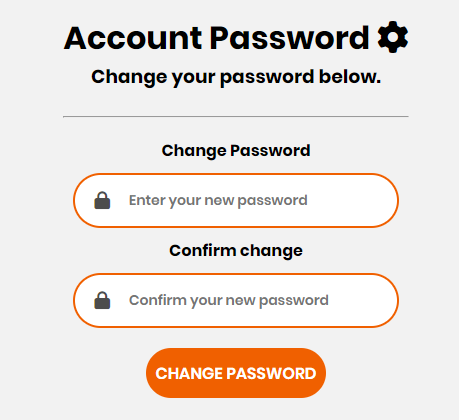
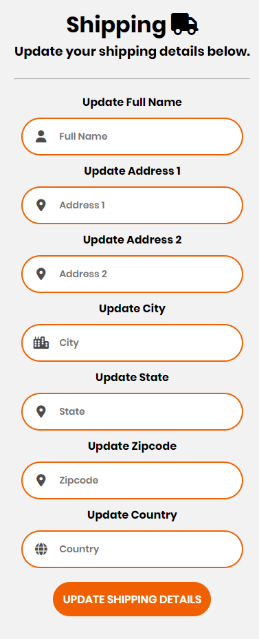
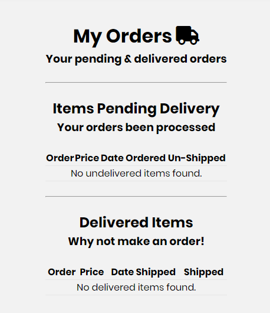

**Review page**  
Users can add a review here if they are authenticated. If they are not, they are presented with an option to register or login.  
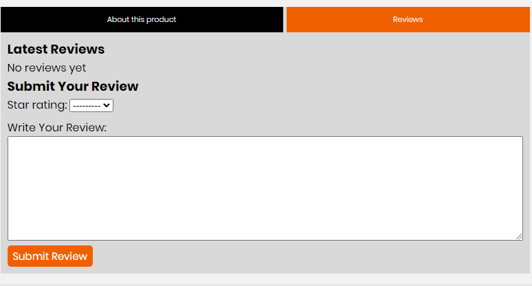
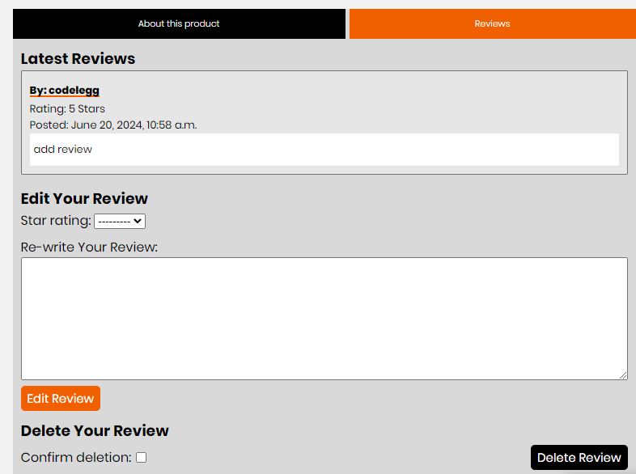

**Cart**  
The basket allows users to view items in their basket. They can see all aspects of there order. I have included a 'view embroidery text' modal because when there was large amount of text, it was difficult to handle on the one page. Users can also change the quantity of product by using append and prepend buttons and updating the order, users can also remove items from their basket here.  

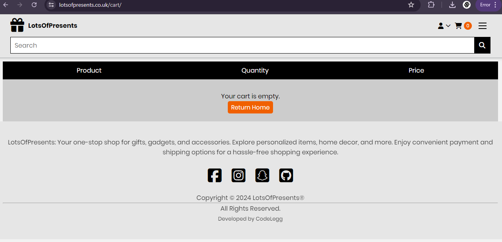

**Checkout**  
Users are presented with details, delivery input boxes and an order summary, They input their personal information and card details underneath. Users can adjust bag or complete order using 'Adjust bag' and 'complete order' buttons. Users will recieve an email confirmation when the order is placed.  

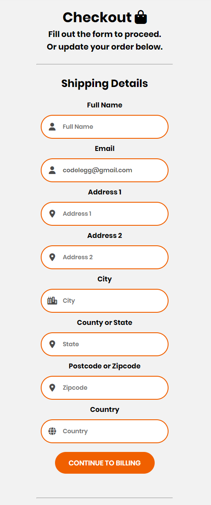
**Checkout Success**  
Users are presented with a 'Thankyou' message and information about their order including order details, delivery info and billing information.  

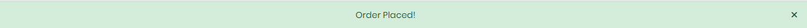

**Logout**  
Users can logout using the icon in the navbar.  
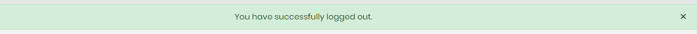
**Footer**   
Users can navigate to respective social media sites that are present in the footer. On non-touchscreen devices, an animation has been added causing the icons to rotate utilising SVG.  

 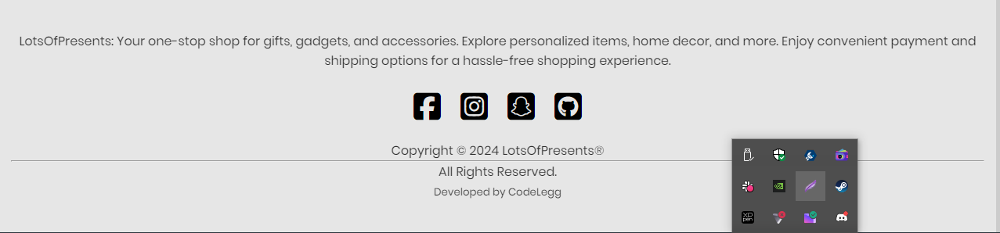
**Toast messages**  
Toast messages have been added to prompt users when siginificant actions are taken on the site such as adding to bag, adding review, registering and logging in. Toast messages have also been set up to handle errors.  

### Future Implementations  
There are a number of different features I would add if i had more time;  
- Add wishlist to users profile, giving users option to add items they wish to purchase.
- Newsletter subscription to keep customers up to date with the business.
- Q & A on products
- More Products & Categories  

## Technologies Used

### Languages Used

**HTML5**  
Used for creation of markup for the website content.  
**CSS**  
Cascading style sheets used to style the individual pages.  
**Javascript**  
Used to toggle visibility of certain aspects of the site.  
**Python**  
Used to run the app.  

### Frameworks, Libraries & Programs Used

[Django 5.0](https://www.djangoproject.com/)  
Used as the backbone of the project for robust data handling, templating, and routing.  

[jQuery](https://jquery.com/)  
I used jQuery to add functionality to Bootstrap components and within my scripts.

[CDN jsdelivr](https://www.jsdelivr.com/)  
CDN jsdeliver was used to serve static assets bootstrap and jquery to improve performance and reliability.

[Google Fonts](https://fonts.google.com/)  
Used to import 'Roboto Mono' font.  

[Font awesome](https://fontawesome.com/)  
Used to import icons on to the site to improve user experience.  

[Github](https://github.com/)   
GitHub is used to store the projects code after being pushed from Git.  

[Balsamiq](https:/balsamiq.com)  
Balsamiq was used to create the wireframes during the design process.  

[Heroku](https://id.heroku.com/login)  
Used to deploy the project.  

[Stripe](https://stripe.com/gb)  
Used to handle payments securely on site.  

[PostgreSQL](https://www.postgresql.org/)  
Hosted the database used in my project.  

[Visual Studio Code](https://code.visualstudio.com/download)  
Visual Studio Code was use to create files pages and where i produced the code for the project.  

[Google Chrome Dev Tools](https://developer.chrome.com/docs/devtools/)    
Google Chrome Dev Tools was used during the testing phase to test the responsiveness of the site and to check for any bugs.
 
[W3schools](https://www.w3schools.com/)    
W3schools was used as a guide for HTML, CSS and Python basic principles.  

[dbdiagram](https://dbdiagram.io/)  
Used to mock up database structure diagram.

## Testing  
Testing process can be found 
[here](TESTING.md)

## Deployment

**How was this site deployed?**

The website was initially deployed on Heroku.

**Deploying on Heroku**  
The following steps will need to be taken to deploy the application using Heroku.

- Create a requirements.txt file.  
- Create a Procfile by typing echo web: python app.py > Procfile. Ensure it starts with a capital P.  
- Go to Heroku. Log in or create an account.  
- Click the 'New' button and click 'Create new app'.  
- Enter a unique name for your project with no capital letters or spaces and select your region. Click 'Create App'.  
- Inside your project, go to the Resources tab and create a Heroku Postgres Database.  
- Inside your project, go to the 'Settings' tab. Scroll down and click 'Reveal Config Vars'.  
- Add in the following variables.
   - SECRET_KEY : Your secret key
   - DATABASE_URL: your postgres database URL
   - STRIPE_PUBLIC_KEY: Your Stripe public key
   - STRIPE_SECRET_KEY: Your stripe secret key
   - USE_AWS: set to 'True'
   - AWS_ACCESS_KEY_ID: Add sccess key ID
   - AWS_SECRET_ACCESS_KEY: Add secret access key.
   - GMAIL_PASSWORD: Add Gmail password from selected account for email confirmation.  
- Deploy your project by going to the Deploy tab and choose 'Connect to Github'
- Find your repository name and select Connect.

**Create a new repository on GitHub**  
- Add the necessary files to the repository.
- Go to the settings page of the repository, located on the menu bar towards the top of the page, scroll down to the GitHub Pages section which is located at the bottom of the 'Code and automation' sub-section.
- Select the main branch and the root folder, then click save.
- The website will now be live at the URL provided in the GitHub Pages section.

**How to clone the repository**

- Go to the (https://github.com/codelegg/ecom )  repository on GitHub.
- Click the "Code" button to the right of the screen, click HTTPs and copy the link there.
- Open a GitBash terminal and navigate to the directory where you want to locate the clone.
- On the command line, type "git clone" then paste in the copied url and press the Enter key to begin the clone process.  

**How to Fork the repository**  

- Go to the https://github.com/codelegg/ecom repository on GitHub.
- Click on the 'Fork' option towards the top left of the page.  
- Click the dropdown button and click 'create a new fork'.  
- This will bring up a page with details of the repository, fill in boxes as required.
- Click 'create fork'.  

For further guidance [click here](https://docs.github.com/en/get-started/quickstart/fork-a-repo)  

Forking this repository will allow changes to be made without affecting the original repository.  

## Credits

### Code Used  

- Code institute learning material Boutique Ado walkthrough.  
- [Django documentation](https://docs.djangoproject.com/en/5.0/)  
- [Stripe Documentation](https://stripe.com/docs/payments)  
- [Codemycom Django Tutorial](https://www.youtube.com/@Codemycom)  

### Content

###  Media

I used Images from freepix and photoshop for the items currently on the website.  

 

